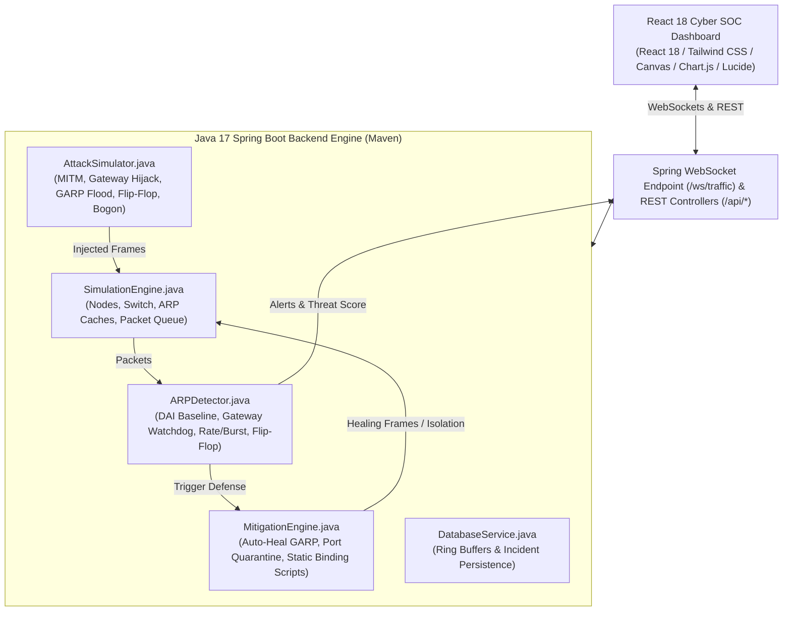

# ARP Network Monitoring System – Detect Abnormal Changes in Simulated ARP Mappings

**Computer Networks Mini Project (Java Spring Boot 3 + React Edition)**  
*A Real-Time Layer-2 Cybersecurity Operations Center (SOC) & Anomaly Detection Web Application*

---

## 📌 1. Project Overview & Abstract

The **Address Resolution Protocol (ARP)** (RFC 826) is a fundamental Layer-2/Layer-3 protocol responsible for mapping IPv4 addresses to physical MAC addresses in local networks. Because standard ARP is stateless and lacks cryptographic authentication, it is vulnerable to **ARP Cache Poisoning**, **Man-In-The-Middle (MITM) hijacking**, **Gateway Spoofing**, and **Gratuitous ARP Storm Flooding**.

This project provides an enterprise-grade **ARP Network Monitoring System** built with **Java 17 (Spring Boot 3 + Maven)** on the backend and **React 18 (Tailwind CSS, Canvas Visualizer, Chart.js)** on the frontend.

### 🌟 Key Capabilities:
1. **Virtual Network Simulation Engine (Java 17 / Spring Boot)**: Simulates a multi-node LAN topology (Gateway Router, DNS Server, Workstations A/B/C, Kali Attacker, and a Virtual Switch) with individual, real-time ARP cache state machines.
2. **Multi-Tier Anomaly Detection Engine**: Implements Dynamic ARP Inspection (DAI), Critical Gateway Watchdog, Sliding-Window Burst/Rate Anomaly Tracking, MAC Flip-Flop Churn Analysis, and Malformed Bogon Filters.
3. **Automated & Manual Mitigation Playbook**: Authoritative Gratuitous ARP Poison-Healer broadcasts, Layer-2 Switch Port Quarantine, and multi-OS static ARP binding script generators.
4. **Interactive Cyber SOC Dashboard (React 18 + WebSockets)**: Interactive HTML5 Canvas topology with live animated packet pulses, synchronized ARP cache matrices, Wireshark-Lite deep packet inspection, real-time threat score gauges, and 1-click printable forensic PDF audit reports.

---

## 🏛️ 2. System Architecture



---

## ⚡ 3. Multi-Tier Anomaly Detection Algorithms

| Detection Tier | Algorithm / Mechanism | Threat Target |
| :--- | :--- | :--- |
| **Tier 1: Dynamic ARP Inspection (DAI)** | Validates every incoming frame against a trusted DHCP Snooping / Static binding table. | Unregistered MAC claiming legitimate host IP |
| **Tier 2: Critical Infrastructure Watchdog** | Dedicated continuous watchdog on Default Gateway (`192.168.1.1`) and DNS Server (`192.168.1.10`). | Default Gateway Hijacking & MITM eavesdropping |
| **Tier 3: Sliding-Window Rate / Flood Detector** | Measures ARP packet arrival rates in a rolling 2-second sliding window ($>18\text{ pps}$ total or $>6\text{ pps}$ GARP). | Gratuitous ARP Flooding & CAM Overflow DoS |
| **Tier 4: MAC Flip-Flop & Churn Detector** | Analyzes transition history per IP; flags rapid oscillating changes ($A \to B \to A$) within 5s. | Race-condition ARP spoofing and cache flapping |
| **Tier 5: Malformed & Bogon Header Validator** | Inspects hardware lengths, broadcast sender MAC (`FF:FF:FF:FF:FF:FF`), and zero MAC (`00:00:00:00:00:00`). | Illegal frame injection & fuzzing |

---

## 🎯 4. Simulated Attack Scenarios

1. **Man-In-The-Middle (MITM) ARP Cache Poisoning**: Injects bidirectional poisoned ARP replies to both Victim Host A (`192.168.1.101`) and Default Gateway (`192.168.1.1`), forcing all subnet communication to route through the attacker (`192.168.1.200`).
2. **Default Gateway Impersonation**: Sends unsolicited Gratuitous ARP announcements claiming the Gateway IP address.
3. **Gratuitous ARP Storm / Denial of Service**: Rapid high-frequency burst of fake Gratuitous ARP packets to exhaust host caches and switch CAM tables.
4. **High-Frequency ARP Flip-Flop**: Rapidly oscillates between legitimate and rogue MAC addresses for an IP.
5. **Bogon & Zero-MAC Injection**: Injects illegal Layer-2 encapsulated frames.
6. **Custom Packet Crafting**: Interactive builder to define custom opcodes, sender/target IPs, and MACs.

---

## 🛡️ 5. Automated & Manual Mitigation Suite

- **Authoritative Gratuitous ARP Cache Healer**: Injects authentic baseline Gratuitous ARP broadcasts across the subnet to cleanse poisoned caches.
- **Layer-2 Switch Port Quarantine**: Blocks the rogue attacker port at the switch level.
- **Multi-OS Static Binding Deployment Generator**:
  - **Windows (10/11)**: `netsh interface ipv4 add neighbors "Ethernet" <IP> <MAC>`
  - **Linux / Ubuntu**: `ip neigh replace <IP> lladdr <MAC> dev eth0 nud permanent`
  - **Cisco Switch (IOS)**: `ip arp inspection vlan 1`, `ip dhcp snooping`, `arp access-list DAI-STATIC`

---

## 🚀 6. Quick Start & Execution

### Prerequisites
- **Java 17+ (JDK 17)** installed
- **Apache Maven 3.8+** installed

### Step 1: Start the Application
Run in your terminal:
```bash
mvn spring-boot:run
```
*(Or double-click `run.bat` on Windows)*

### Step 2: Open in Browser
Visit **`http://localhost:8080`** in your web browser. The React Cyber SOC interface will load instantly!

---

## 📁 7. Project Directory Structure

```
CN Project/
├── pom.xml                                     # Maven build file (Spring Boot 3 + Web + WebSockets)
├── run.bat                                     # 1-Click launcher for Windows
├── README.md                                   # Comprehensive project documentation
│
├── src/main/java/com/arp/monitor/              # Java Backend Core
│   ├── ArpMonitorApplication.java              # Main Spring Boot application & simulation loop
│   ├── model/                                  # Java Domain Models
│   │   ├── ARPPacket.java                      # Ethernet & ARP Frame model
│   │   ├── NetworkNode.java                    # Virtual Host model
│   │   ├── ARPCacheEntry.java                  # Node ARP table entry model
│   │   ├── Alert.java                          # Security anomaly incident model
│   │   ├── AlertSeverity.java, NodeRole.java, NodeStatus.java
│   │   └── ThreatMetrics.java, AttackConfig.java, CustomPacketRequest.java
│   ├── detector/
│   │   └── ARPDetector.java                    # DAI, Gateway Watchdog, Rate, Flip-Flop detection
│   ├── mitigation/
│   │   └── MitigationEngine.java               # Auto-defense, Healing GARP, Port quarantine
│   ├── simulation/
│   │   ├── SimulationEngine.java               # Subnet state machine & background traffic
│   │   └── AttackSimulator.java                # MITM, Hijack, GARP Storm generators
│   ├── websocket/
│   │   ├── WebSocketConfig.java                # Spring WebSocket configuration
│   │   └── TrafficWebSocketHandler.java        # WebSocket event broadcaster (/ws/traffic)
│   ├── controller/
│   │   ├── TopologyController.java             # REST API for topology & forensics export
│   │   ├── AttackController.java               # REST API for attack injection
│   │   ├── MitigationController.java           # REST API for healing & isolation
│   │   └── PacketController.java               # REST API for packet streams & alerts
│   └── service/
│       └── DatabaseService.java                # In-memory circular buffer & session logger
│
├── src/main/resources/
│   ├── application.properties                  # Spring Boot configuration (Port 8080)
│   └── static/
│       └── index.html                          # React 18 Cyber SOC Single Page Application
│
└── frontend-react/                             # Standalone React 18 + Vite Project
    ├── package.json
    ├── vite.config.js
    ├── tailwind.config.js
    └── src/
        ├── App.jsx, main.jsx, index.css
        └── components/ (TopologyCanvas, ArpCacheMatrix, AttackStudio, WiresharkAnalyzer, etc.)
```

---

## 🎓 8. High-Yield Questions 

### Q1: What is Address Resolution Protocol (ARP) and why is it needed?
**Answer:** ARP (RFC 826) maps a Layer-3 IPv4 address to a Layer-2 physical MAC address within a local broadcast domain. Ethernet frames require destination hardware MAC addresses for delivery across switches and network interfaces.

### Q2: Why is standard ARP vulnerable to spoofing and cache poisoning?
**Answer:** ARP is inherently trust-based and stateless. Nodes accept unsolicited ARP replies without verifying whether a request was ever issued. An attacker can send forged ARP replies claiming another host's IP with the attacker's MAC address.

### Q3: What is the difference between ARP Request, ARP Reply, and Gratuitous ARP?
**Answer:**
- **ARP Request (Opcode 1)**: Broadcast (`FF:FF:FF:FF:FF:FF`) asking *"Who has IP X? Tell IP Y"*.
- **ARP Reply (Opcode 2)**: Unicast frame responding *"IP X is at MAC X"*.
- **Gratuitous ARP (GARP)**: ARP Reply where Sender IP equals Target IP, broadcast to the entire LAN for IP collision detection or cache update.

### Q4: How does Dynamic ARP Inspection (DAI) prevent ARP poisoning?
**Answer:** DAI is a switch security feature that validates incoming ARP packets on untrusted ports against a trusted binding table (DHCP Snooping database or static ACLs). Frames with mismatched IP-to-MAC bindings are dropped immediately.

### Q5: How does this project's auto-healing mitigation work?
**Answer:** When an anomaly is detected, the mitigation engine broadcasts an authoritative Gratuitous ARP packet containing the legitimate baseline MAC for the victim IP. All hosts receiving this frame immediately overwrite and restore their corrupted ARP caches.
